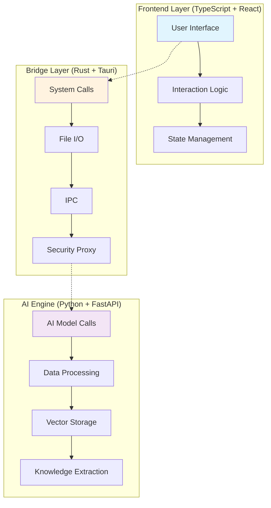

<div align="center">

# 📚 KnowledgeFocus

> **Unlock the knowledge value of local files with a privacy-first desktop agent platform**

[](https://opensource.org/licenses/Apache-2.0)
[](https://tauri.app/)
[](https://python.org)
[](https://typescriptlang.org)
[](https://rust-lang.org)

**🌏 Language**: [English](#) | [中文](tauri-app/README_CN.md)

[Quick Start](#-quick-start) • [Development](#-development-guide) • [Architecture](#-architecture) • [Contributing](#-contributing)

</div>

---

## 💡 Project Vision

In the era of artificial intelligence, the value of personal data is undeniable. However, for most people, precious knowledge often scatters across various folders and gradually gets forgotten. **KnowledgeFocus** was born from a simple yet powerful vision:

> Let every file lying dormant on your computer shine with the light of knowledge again ✨

### 🎯 Core Values

- **🔒 Privacy First**: Files are processed locally, core data never uploaded, users have complete control over data flow
- **🧠 AI Empowerment**: Combining local computing power with cloud-based large models for optimal intelligent experience
- **🔍 Knowledge Mining**: Rediscovering value from forgotten files, making historical accumulation serve the present
- **🚀 Platform Design**: Open desktop agent platform supporting plugin extensions and custom tools

---

## ✨ Core Features

### 📂 Intelligent File Management System

- **Comprehensive Scanning**: Rapidly scan and analyze local files, intelligently identify knowledge carriers
- **Real-time Monitoring**: Continuously monitor file changes to keep knowledge base always up-to-date
- **Dynamic Tagging**: AI-powered intelligent tagging system for well-organized file management

### 🔍 Multimodal Knowledge Retrieval

- **Cross-modal Understanding**: Support content understanding and retrieval for text, images, audio, and video
- **Semantic Search**: AI-powered semantic search, more accurate than keyword-based search
- **Vector Storage**: Efficient vector storage and retrieval using LanceDB

### 💬 Document Conversation & Co-reading

- **Intelligent Conversation**: Chat directly with your documents for precise answers
- **PDF Co-reading**: Innovative "study companion" mode where AI understands what you're reading in real-time
- **Knowledge Cards**: Automatically generate structured knowledge fragments for future use

### 🤖 Desktop Agent Platform

- **Operation Automation**: Agents can assist in controlling other applications for workflow automation
- **Tool Extensions**: Open plugin system supporting custom tools and agents
- **Cross-app Collaboration**: Intelligent collaboration across applications based on file knowledge

---

## 🏗️ Architecture

KnowledgeFocus adopts a unique **tri-language hybrid architecture**, leveraging the strengths of each language:


<!-- 
Architecture diagram requirements:
- Size: 800x600px
- Format: PNG with transparent background
- Content: Show the three-layer architecture with TypeScript frontend, Rust bridge, and Python AI engine
- Style: Modern, clean design with clear component separation and data flow arrows
-->



### 🔧 Technology Stack

| Layer | Technology | Responsibility |
|-------|------------|----------------|
| **Frontend** | React + TypeScript + TailwindCSS + shadcn | User interface and interaction |
| **Bridge** | Rust + Tauri | System calls, file operations, security proxy |
| **AI Engine** | Python + FastAPI + PydanticAI | AI inference, data processing, knowledge extraction |
| **Storage** | SQLite + LanceDB | Metadata storage, vector storage |
| **AI Ecosystem** | Vercel AI SDK + MLX + Docling | Multimodal understanding, local inference |

### 🎨 Design Highlights

- **Performance Optimization**: Rust handles high-performance I/O operations for ultimate file scanning and monitoring efficiency
- **AI Integration**: Perfect combination of Python's AI ecosystem with modern web technologies
- **Security Design**: Sensitive data and API keys securely proxied through Rust layer
- **Extensibility**: Modular design supporting plugin development and feature extensions

---

## 🚀 Quick Start

### For End Users

1. **Download**: Get the appropriate version for your OS from [Releases](../../releases)
2. **Install**: Follow the installation wizard to complete setup
3. **Grant Permissions**: Authorize the app to access "Full Disk Access" on first run
4. **Configure Models**: Select and configure your preferred AI models in settings (supports various cloud and local models)
5. **Start Exploring**: Let AI help you rediscover knowledge treasures in your files!

### For Developers

```bash
# 1. Clone the repository
git clone https://github.com/huozhong-in/knowledge-focus.git
cd knowledge-focus

# 2. Setup Python environment
cd api
uv sync  # Install uv first: https://docs.astral.sh/uv/

# 3. Setup frontend environment
cd ../tauri-app
bun install  # Install bun first: https://bun.sh/

# 4. Start development server
bun tauri dev
```

> 💡 **Note**: First run requires downloading and compiling Rust dependencies, please be patient.

---

## 📖 Development Guide

### System Requirements

- **OS**: macOS 10.15+ / Windows 10+ / Ubuntu 18.04+
- **Rust**: 1.70+ (auto-installed)
- **Python**: 3.11+
- **Node.js**: 18+ (recommend using bun)

### Project Structure

```shell
knowledge-focus/
├── tauri-app/          # Frontend app (TypeScript + React)
├── api/                # Backend API (Python + FastAPI) 
├── docs/               # Project documentation
└── README.md           # Project description
```

### Core Commands

```bash
# Development mode
cd tauri-app && bun tauri dev

# Build application
cd tauri-app && bun tauri build

# Run API standalone (for debugging)
cd api && uv run python api_standalone.py

# Run tests
cd api && uv run pytest
```

### 🔌 Plugin Development

KnowledgeFocus provides a powerful plugin system where you can:

- **Extend Tools**: Add new Python tools in the `api/tools/` directory
- **Custom Agents**: Develop specialized agents based on PydanticAI framework
- **External Services**: Integrate third-party services through FastAPI endpoints

For detailed plugin development guide, please refer to: [Plugin Development Documentation](docs/plugin-development.md)

---

## 🛠️ Advanced Configuration

### Data Storage Locations

- **macOS**: `~/Library/Application Support/knowledge-focus.huozhong.in/`
- **Windows**: `%APPDATA%/knowledge-focus.huozhong.in/`
- **Linux**: `~/.local/share/knowledge-focus.huozhong.in/`

### Log Files

Application logs are stored in the `logs/` subdirectory of the data directory for troubleshooting and performance monitoring.

### AI Model Configuration

Support for multiple AI model providers:

- OpenAI GPT series
- Anthropic Claude
- Google Gemini
- xAI Grok
- OpenRouter
- Groq
- Local Ollama/LM Studio
- Custom model endpoints

---

## 🤝 Contributing

We warmly welcome community contributions! Whether you are:

- 🐛 Reporting bugs
- 💡 Suggesting new features
- 📚 Improving documentation
- 🔧 Optimizing code

You can participate through the following ways:

1. **Fork** the project to your GitHub account
2. **Create a feature branch** (`git checkout -b feature/amazing-feature`)
3. **Commit your changes** (`git commit -m 'Add some amazing feature'`)
4. **Push the branch** (`git push origin feature/amazing-feature`)
5. **Create a Pull Request**

### Development Standards

- Follow the project's code style and naming conventions
- Add corresponding tests for new features
- Update relevant documentation
- Ensure CI checks pass

---

## 📄 License

This project is licensed under the [Apache-2.0](LICENSE) license.

---

## 📞 Contact Us

- **📧 Email**: dio1chou[at]gmail.com
- **🐛 Bug Reports**: [GitHub Issues](../../issues)
- **💬 Discussions**: [GitHub Discussions](../../discussions)

---

<div align="center">

**⭐ If this project helps you, please give us a Star!**

Made with ❤️ by [huozhong-in](https://huozhong.in)

</div>

