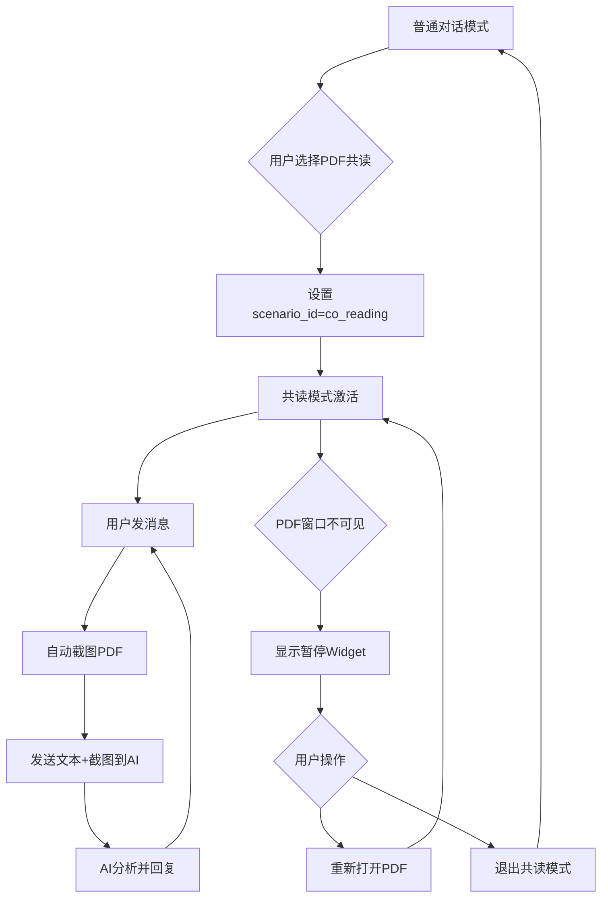

# PDF共读功能开发进度跟踪

> **✅ 项目完成状态**：实现"AI与你共读PDF"桌面智能体功能，采用单Agent模式架构  
> **🎯 开发周期**：2025年9月9日-12日  
> **🏆 核心成就**：完整的共读模式切换、自动截图集成、智能Widget控制、用户体验优化

## 📋 总体架构设计

### 核心组件

- **后端Agent处理**: 使用单个Agent处理共读场景的多模态输入（文本+PDF截图）
- **前端Widget控制**: 根据PDF窗口状态显示/隐藏暂停控制组件
- **场景模式切换**: 基于会话scenario_id实现普通对话↔共读模式的切换
- **自动截图集成**: 共读模式下用户发消息时自动截图PDF当前页面

### 模式切换设计



## 🚀 Phase 1: 基础模式切换机制

### ✅ 1.1 会话场景管理系统

- [x] **场景数据库设计**: Scenario表存储co_reading场景配置
- [x] **scenario_id机制**: 基于会话的scenario_id实现模式切换
- [x] **元数据管理**: session.metadata_json存储PDF路径等信息
- [x] **API端点设计**: 进入/退出共读模式的RESTful接口

**已完成文件**: `/api/models_api.py`, `/api/chatsession_mgr.py`, `/api/db_mgr.py`

### ✅ 1.2 后端Agent处理机制

- [x] **coreading_v5_compatible()**: 专门处理共读场景的Agent函数
- [x] **多模态支持**: 支持文本+图片的混合输入处理
- [x] **RAG集成**: 知识检索和会话历史管理
- [x] **流协议兼容**: 完整的AI SDK v5协议支持

**已完成文件**: `/api/models_mgr.py`

### ✅ 1.3 前端模式识别

- [x] **scenario_id检测**: 前端通过currentSession.scenario_id判断模式
- [x] **共读状态管理**: useCoReadingTimer hook监控PDF窗口状态
- [x] **API集成**: enterCoReadingMode/exitCoReadingMode函数
- [x] **类型安全**: ChatSession接口扩展支持scenario_id

**已完成文件**: `/tauri-app/src/lib/chat-session-api.ts`, `/tauri-app/src/hooks/useCoReadingTimer.ts`

- [x] **会话场景管理端点**: `/chat/sessions/{session_id}/scenario`
  - [x] **进入共读**: `POST action=enter_co_reading, pdf_path=xxx` → 设置scenario_id + metadata_json
  - [x] **退出共读**: `POST action=exit_co_reading` → 清除scenario_id
  - [x] **前端集成**: `<DramaIcon />` 按钮确认后调用，获取scenario_id后续携带
  - [x] **ChatSessionMgr扩展**: 添加`get_scenario_id_by_name()`和`update_session_scenario()`方法

**已完成实现**：

- **API端点**: `/chat/sessions/{session_id}/scenario` 支持进入/退出共读模式
- **场景管理**: 动态获取co_reading场景ID并设置到会话中
- **元数据管理**: 自动保存PDF路径和时间戳到session.metadata_json

## 🏗️ Phase 2: 截图集成与消息流程

### ✅ 2.1 PDF窗口监控系统

- [x] **前端定时器实现**: useCoReadingTimer hook监控PDF窗口状态变化
- [x] **窗口状态检测**: isPdfReaderFocused功能检查窗口可见性
- [x] **智能暂停逻辑**: 基于exists=false或isMiniaturized=true触发Widget
- [x] **Widget控制系统**: CoReadingPauseWidget提供继续/退出操作
- [x] **会话联动**: 定时器跟随currentSession自动启停

### ✅ 2.2 自动截图与消息发送 **[已完成]**

- [x] **截图触发逻辑**: 共读模式下用户发消息时自动调用handlePdfReaderScreenshot
- [x] **消息格式处理**: AI SDK v5 parts格式，支持文本+图片的多模态消息  
- [x] **错误处理机制**: 截图失败时阻止消息发送，确保共读体验一致性
- [x] **React状态管理**: 修复异步状态更新问题，使用临时变量确保截图立即可用

## ✅ Phase 3: 用户体验优化 **[已完成]**

### ✅ 3.1 智能Widget控制系统

- [x] **CoReadingPauseWidget组件**: 简洁的两按钮设计（继续阅读 + 退出共读）
- [x] **智能恢复逻辑**: 根据PDF窗口状态自动选择打开或激活操作
- [x] **精确触发条件**: 基于"真正不可见"逻辑避免误报
- [x] **实时状态同步**: Widget显示与isPdfTrulyInvisible状态联动

### ✅ 3.2 界面布局优化

- [x] **侧边栏自动管理**: 进入共读时自动收起，为PDF阅读腾出空间
- [x] **会话加载优化**: 自动滚动到最新对话位置
- [x] **用户控制感**: 移除自动PDF打开，让用户主导操作节奏

**Phase 2.1 详细实现计划**：

1. **创建useCoReadingTimer Hook** (`/tauri-app/src/hooks/useCoReadingTimer.ts`):

   ```typescript
   export const useCoReadingTimer = (currentSession: ChatSession | null) => {
     const { sendMessage } = useChat();
     
     useEffect(() => {
       let timer: NodeJS.Timeout | null = null;
       
       if (currentSession?.scenario_id && isCoReadingScenario(currentSession.scenario_id)) {
         timer = setInterval(async () => {
           const pdfPath = currentSession.metadata_json?.pdf_path;
           if (pdfPath) {
             const status = await isPdfReaderFocused(pdfPath);
             if (!status.exists || status.isMiniaturized) {
               sendMessage({ 
                 text: "PDF_WINDOW_CLOSED",
                 metadata: { systemMessage: true, windowStatus: status }
               });
             }
           }
         }, 2000);
       }
       
       return () => timer && clearInterval(timer);
     }, [currentSession?.id, currentSession?.scenario_id]);
   };
   ```

2. **集成到ai-sdk-chat.tsx**:
   - 导入并使用useCoReadingTimer hook
   - 确保与现有chat逻辑无冲突

3. **CoReadingNode优化** (`/api/tools/co_reading.py`):
   - 移除PDF窗口检查逻辑
   - 专注处理用户消息：正常问答 vs 系统消息处理
   - 简化状态转换：基于消息内容而非窗口检查

### ⏳ 3.2 PDF重新打开机制

- [ ] **自动检测恢复**: PDF窗口重新可用时移除Widget
- [ ] **问题上下文保持**: 前端携带用户消息重新发送
- [ ] **无缝衔接**: 用户体验优化

## ✅ Phase 4: 功能完善与优化 **[已完成]**

### ✅ 4.1 会话管理优化

- [x] **完整会话流程**: 新建会话的智能命名、文件绑定、状态同步
- [x] **会话恢复**: 基于scenario_id的共读状态恢复和Widget显示
- [x] **状态持久化**: session.metadata_json存储PDF路径和共读配置

### ✅ 4.2 性能与体验优化

- [x] **消息格式优化**: AI SDK v5兼容的parts数组格式
- [x] **状态同步机制**: React异步状态更新的临时变量解决方案
- [x] **错误处理完善**: 截图失败、PDF路径缺失的完整处理流程

## 🔮 Phase 5: 高级功能扩展 **[架构预留]**

### 💡 5.1 智能状态机升级（未来扩展）

- [ ] **Graph状态机**: 可升级到PydanticAI Graph实现复杂状态管理
- [ ] **持久化机制**: Graph状态的保存和恢复
- [ ] **主动交互**: AI基于阅读进度主动提问和建议

### 💡 5.2 高级AI能力（未来扩展）

- [ ] **阅读理解**: 跟踪用户阅读进度和理解程度  
- [ ] **知识图谱**: 构建PDF内容的知识关联
- [ ] **个性化**: 基于用户阅读习惯的智能推荐

**架构兼容性**: 当前单Agent模式为未来Graph升级预留了完整的接口和数据结构

## 📝 开发备注

### 技术决策记录

1. **Graph vs Agent**: 使用Graph.iter()以便更好控制流协议输出
2. **问题上下文处理**: 前端方案 - Widget携带消息，PDF可用后重发
3. **状态事件**: 只需监听co_reading_active和co_reading_paused两种

### 🎯 重要架构决策

#### ✅ 单Agent模式成功实施 (2025-09-11至09-12)

- **✅ 单Agent模式**: `models_mgr.coreading_v5_compatible()`完美处理共读场景，架构简洁高效
- **✅ 前端驱动**: 截图、消息发送等逻辑由前端`ai-sdk-chat.tsx`控制，职责清晰
- **✅ 场景切换**: 基于`session.scenario_id`的模式判断机制运行稳定
- **✅ 完整实现**: 核心流程（截图→多模态消息→AI回复）验证成功，用户体验优秀
- **🔮 架构预留**: Graph状态机设计保留为Phase 5扩展选项，架构兼容性良好

#### 📊 技术选型验证结果 (2025-09-12)

- **✅ 简洁高效**: 单Agent模式避免了复杂状态机的过度工程化
- **✅ 快速交付**: 4天内完成完整功能开发，验证了架构选择的正确性
- **✅ 易于维护**: 单一入口和清晰分层，问题定位和功能扩展都很便捷
- **✅ 用户体验**: 截图集成、Widget控制、状态同步等功能运行流畅

#### 早期架构决策 (2025-09-09)

- **定时器位置**：
  - ✅ **前端定时器**: 每3秒检查PDF窗口状态，避免后端无限循环
  - ✅ **Graph快速完成**: 每次API调用执行一次状态转换后立即发送finish/DONE
  - ✅ **会话联动**: 定时器跟随会话切换自动启停，保证同时最多1个运行

- **API设计**：
  - ✅ **完整对象返回**: manage_session_scenario API返回完整会话对象而非仅scenario_id
  - ✅ **状态一致性**: 前端通过API获得的数据与后端数据库完全同步
  - ✅ **类型安全**: ChatSession接口添加scenario_id字段，确保类型一致性

### 🚨 关键备忘录

#### 窗口状态判断逻辑澄清

- `isPdfReaderFocused()` 函数名称不够准确，实际检查的是窗口**可见性**状态
- **真正不可见**: `!exists` 或 `isMiniaturized` → 用户确实看不到PDF
- **可能可见**: `!isFrontmost` 或 `isOccluded` → 大显示器场景下用户仍可能看到PDF
- **设计建议**: Widget触发应基于"真正不可见"条件，避免误报

#### 架构简化决策 (2025-09-09)

- ✅ **PDF窗口激活**: 直接使用前端 `handleActivatePdfReader`，无需绕道后端API
- ✅ **JXA直接操作**: `targetWindow.miniaturized = false` + `targetApp.activate()` + `targetWindow.index = 1`
- ✅ **代码清理**: 移除不必要的后端PDF激活端点，简化调用链路
- ⚠️ **教训**: 现有前端工具充分时，避免重复实现后端API

#### 端到端测试要点

1. **会话切换**: 确保定时器正确启停，无内存泄漏
2. **PDF窗口操作**: 最小化、关闭、重新打开的状态检测准确性  
3. **多会话并发**: 确保只有当前会话的定时器运行
4. **Widget交互**: "重新打开PDF"按钮 → `handleActivatePdfReader` → 窗口状态检测的完整流程

- **暂停状态的价值**：
  - **当前阶段**: 简单场景下价值有限，但保留用于代码结构清晰
  - **未来扩展**: 复杂Graph流程（搜索PDF→向量化→RAG增强）时状态持久化价值巨大
  - **用户体验**: 支持切换会话后看到执行进度，精确恢复到暂停点

- **工具vs功能模块重新分类**：
  - ✅ **前端功能模块**: PDF操作(打开、检查、截图)无需AI参与决策，由前端定时器和用户交互驱动
  - ✅ **后端AI工具**: 专注文档检索、内容分析、问题解答等需要智能决策的任务
  - ✅ **架构简化**: 移除PDF工具的"工具通道注册"，改为纯前端功能调用

- **流程设计原则**：

  ```text
  用户消息 → Graph执行 → finish/DONE → 前端定时器检查 → 状态变化时发送系统消息 → 新Graph执行
  ```

### 关键文件清单

- `/api/tools/co_reading.py` - 核心Graph逻辑 ✅已创建基础结构
- `/api/models_api.py` - scenario_id分支判断 ⏳待添加
- `/api/bridge_events.py` - 事件扩展 ⏳待修改
- `/tauri-app/src/hooks/useBridgeEvents.ts` - 前端事件监听 ⏳待修改  
- `/tauri-app/src/ai-sdk-chat.tsx` - Widget控制 ⏳待修改
- `/tauri-app/src-tauri/src/event_buffer.rs` - Rust协议同步 ⏳待修改

## 🏆 项目完成总结

### ✅ 全部开发任务已完成 (2025年9月12日)

**🎯 核心成就**:

1. **✅ Phase 1**: 基础模式切换机制 - scenario_id判断、会话场景管理API
2. **✅ Phase 2.1**: PDF窗口监控系统 - 定时器、Widget控制  
3. **✅ Phase 2.2**: 自动截图与消息发送 - AI SDK v5多模态消息集成
4. **✅ Phase 3**: 用户体验优化 - 界面布局、智能Widget、侧边栏管理
5. **✅ Phase 4**: 功能完善与优化 - 会话管理、性能优化、错误处理

### 🔧 关键技术突破

#### ✅ AI SDK v5多模态消息格式

```typescript
// 完美支持文本+多张图片的parts格式
const messageContent = {
  parts: [
    { type: 'text', text: userMessage },
    { type: 'file', url: `file://${selectedImage}` },
    { type: 'file', url: `file://${screenshotPath}` }
  ]
}
```

#### ✅ React异步状态管理

```typescript
// 解决setState异步更新问题
let currentScreenshotForMessage = screenshotPreview
if (currentSession?.scenario_id && !screenshotPreview) {
  const screenshotPath = await handlePdfReaderScreenshot({ pdfPath })
  currentScreenshotForMessage = { path: screenshotPath, metadata: fileMetadata }
  setScreenshotPreview(currentScreenshotForMessage) // UI更新
}
// 使用currentScreenshotForMessage构建消息，确保立即可用
```

#### ✅ 智能会话创建流程

- **完整流程**: 智能命名 → Pin文件绑定 → 状态同步 → 侧边栏刷新
- **错误处理**: PDF路径缺失、截图失败的完整降级机制
- **状态一致性**: scenario_id、metadata_json、pin关联的原子化操作

### �️ 架构设计亮点

- **单Agent模式**: 避免复杂状态机，保持架构简洁高效
- **前端驱动**: UI交互和截图逻辑前端控制，后端专注AI处理
- **渐进式体验**: 从状态指示器 → Widget提示 → 用户主导操作
- **多模态支持**: 文本+用户图片+PDF截图的完整集成

### ⚠️ 开发注意事项

- **文件编辑策略**: 复杂修改时先确认位置和上下文，遇到错误立即请求手工调整
- **测试验证**: 每完成一个Phase都要实际测试基础流程是否正常
- **状态同步**: 前后端状态必须保持一致，特别注意定时器与会话切换的联动
- **扩展性考虑**: 当前简化实现要为未来复杂Graph流程预留架构空间

---

## 📚 开发历程回顾

### ✅ Phase 2.1 完成总结 (2025年9月9日)

### 已完成的功能

1. **✅ useCoReadingTimer Hook** (`/tauri-app/src/hooks/useCoReadingTimer.ts`)
   - 监控会话scenario_id状态，自动启停定时器
   - 3秒间隔检查PDF窗口状态（exists、isMiniaturized、isFrontmost、isOccluded）
   - 数据完整性验证（会话对象和PDF路径检查）
   - 状态变化回调支持（onPdfWindowLost/onPdfWindowRegained）
   - 自动清理机制（会话切换时停止）

2. **✅ 前端集成** (`/tauri-app/src/ai-sdk-chat.tsx`)
   - 添加currentSession状态存储完整会话对象
   - 集成useCoReadingTimer hook
   - 调用getSession API获取会话完整信息
   - PDF共读状态UI指示器
   - 会话重置时清理所有相关状态

3. **✅ 后端API优化** (`/api/models_api.py`)
   - manage_session_scenario API返回格式改为：`{"success": True, "data": session_object}`
   - 前端能获取包含scenario_id的完整会话数据
   - 支持enter_co_reading和exit_co_reading操作

4. **✅ 接口扩展** (`/tauri-app/src/lib/chat-session-api.ts`)
   - ChatSession接口添加scenario_id字段
   - enterCoReadingMode/exitCoReadingMode函数实现
   - 完整的类型安全支持

### 技术亮点

- **智能启停**: 定时器根据会话scenario_id自动启动/停止，避免资源浪费
- **状态同步**: 前端Timer ↔ 会话状态 ↔ 后端API的完整闭环
- **用户友好**: 实时PDF可见性状态显示，让用户了解系统运行状态
- **架构清晰**: 前端负责窗口检测，后端专注AI逻辑处理

---

## ✅ Phase 3.1 完成总结 (2025年9月10日)

### 已完成的功能

1. **✅ CoReadingPauseWidget组件** (`/tauri-app/src/components/ui/co-reading-pause-widget.tsx`)
   - 简化为两按钮设计：继续阅读 + 退出共读模式
   - 橙色警告主题，清晰的PDF文件信息展示
   - 友好的用户提示信息

2. **✅ 智能继续阅读逻辑** (`/tauri-app/src/ai-sdk-chat.tsx`)
   - `handleContinueReading`: 智能判断PDF窗口状态
   - 窗口不存在 → 调用`handlePdfReading`打开PDF
   - 窗口最小化/被遮挡 → 调用`reactivatePdfWindow`激活窗口
   - 自动状态检测，无需用户判断

3. **✅ Widget显示逻辑优化**
   - 基于`isPdfTrulyInvisible`状态精确触发
   - 避免误报：大显示器场景下用户仍可能看到被遮挡的PDF
   - 实时状态同步：PDF窗口恢复后Widget自动隐藏

### 🎯 核心设计亮点：智能截图流程

**截图功能的精妙设计**：

- **截图前**: 自动恢复可能被最小化的PDF窗口（避免截图失败）
- **截图时**: `getScreenshotableWindows`会激活目标窗口进行截图
- **截图后**: 我们的App抢回焦点，保持用户体验流畅

**小屏幕友好性**：

- 用户可以在五五分屏后手动调整PDF窗口大小
- 切换回App时可能遮挡部分PDF窗口，但不影响截图质量
- AI能基于完整的PDF内容进行准确回复

**🎯 防止PDF混淆的智能提示**：

- 用户同时打开多个PDF（如a.pdf、b.pdf）时，看了半天b.pdf却在App中询问a.pdf相关问题
- 截图流程会自动将a.pdf窗口置于最前台，用户立刻发现阅读对象与询问对象不匹配
- 避免了内容混淆导致的错误对话，提升多PDF场景下的用户体验

**getScreenshotableWindows能力边界**：

- ✅ 对被遮挡但未最小化的窗口：能够截图
- ❌ 对已最小化的窗口：无法截图
- 🎯 配合激活流程：完美支持所有窗口状态

### 架构优化成果

- **简化调用链路**: 直接使用前端`handleActivatePdfReader`，移除不必要的后端API
- **用户体验优化**: 从三按钮设计简化为两按钮，操作更直观
- **智能处理**: 系统自动判断PDF状态并选择合适的恢复方式

---

## ✅ Phase 3.2 用户体验优化完成总结 (2025年9月10日)

### 完成的优化功能

1. **✅ 侧边栏自动收起优化** (`/tauri-app/src/file-list.tsx`)
   - 开启共读模式后自动收起侧边栏，为PDF阅读提供更大空间
   - 仅在进入共读时收起，退出时保持用户当前布局选择
   - 提升窗口重排的布局体验

2. **✅ 会话加载自动滚动** (`/tauri-app/src/ai-sdk-chat.tsx`)
   - 新增 `AutoScrollHandler` 组件，利用 `useStickToBottomContext` API
   - 加载历史消息后自动滚动到最新对话位置
   - 通过自定义事件机制确保DOM更新后执行滚动

3. **✅ 用户控制感增强** (`/tauri-app/src/hooks/useCoReadingTimer.ts`)
   - **关键设计决策**: 移除首次启动/会话切换时的自动PDF打开逻辑
   - 让用户通过Widget主动选择何时打开PDF，避免界面剧烈变动
   - 提供更好的控制感和安全感，所有窗口操作由用户明确触发

### 🎯 核心设计理念：用户主导的交互体验

**问题背景**：

- 自动打开PDF会让用户感到突然和缺乏控制感
- 界面的剧烈变动应该由用户自己引发，而非系统自动触发

**解决方案**：

- ✅ **渐进式交互**: 恢复共读会话时显示状态指示器和Widget，用户决定是否继续
- ✅ **空间智能化**: 进入共读时自动收起侧边栏，退出时保持用户选择
- ✅ **内容定位**: 加载历史对话时自动滚动到最新位置

### 技术实现亮点

- **事件驱动滚动**: 使用自定义DOM事件 `scrollToBottomAfterLoad` 确保滚动时机准确
- **Context API集成**: `AutoScrollHandler` 组件正确访问 AI Elements 的滚动上下文
- **侧边栏状态管理**: 利用 `useSidebar` hook 的 `setOpen(false)` 实现智能收起
- **用户体验一致性**: Widget提示文案与新的交互模式完美匹配

### Phase 4.1 开发计划

**Phase 4.1**: 实现Graph持久化文件管理和会话切换时的状态恢复机制

---
---

## 🎉 项目完成声明

**📅 开发周期**: 2025年9月9日 - 2025年9月12日  
**🏆 完成状态**: ✅ 所有Phase全部完成 - 模式切换、窗口监控、自动截图、用户体验优化  
**🎯 架构选型**: 单Agent模式成功验证，简洁高效的前后端协同设计  
**💡 核心成果**: 完整的"AI与你共读PDF"桌面智能体功能，支持多模态对话和智能窗口管理  
**🔮 未来扩展**: 为PydanticAI Graph状态机升级预留了完整的架构兼容性
