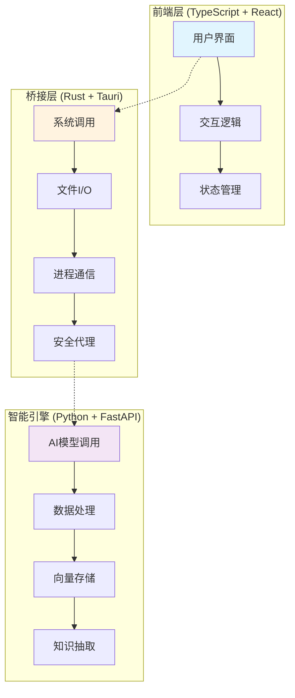

<div align="center">

# 📚 KnowledgeFocus

> **释放本地文件的知识价值，隐私至上的桌面智能体平台**

[](https://opensource.org/licenses/Apache-2.0)
[](https://tauri.app/)
[](https://python.org)
[](https://typescriptlang.org)
[](https://rust-lang.org)

**🌏 Language**: [中文](#) | [English](../README.md)

[下载体验](#快速体验) • [开发文档](#开发环境搭建) • [架构设计](#技术架构) • [贡献指南](#贡献指南)

</div>

---

## 💡 项目理念

在人工智能时代，个人数据的价值不言而喻。然而，对于普通人来说，珍贵的知识往往散落在各个文件夹中，逐渐被遗忘。**KnowledgeFocus** 诞生于一个简单而强大的理念：

> 让每一个躺在你电脑里的文件，都能重新焕发知识的光芒 ✨

### 🎯 核心价值

- **🔒 隐私至上**：文件在本地处理，核心数据永不上传，用户完全掌控数据流向
- **🧠 智能赋能**：结合本地算力与云端大模型，实现最佳的智能化体验
- **🔍 知识挖掘**：从被遗忘的文件中重新发现价值，让历史积累为当下服务
- **🚀 平台化设计**：开放的桌面智能体平台，支持插件扩展和自定义工具

---

## ✨ 核心功能

### 📂 智能文件管理系统

- **全面扫描**：快速扫描并分析本地文件，智能识别知识载体
- **实时监控**：持续监控文件变化，确保知识库始终保持最新
- **动态标签**：基于AI的智能标签系统，让文件组织井井有条

### 🔍 多模态知识检索

- **跨模态理解**：支持文本、图片、音视频的内容理解和检索
- **语义搜索**：基于语义的智能搜索，比关键词搜索更精准
- **向量化存储**：使用 LanceDB 实现高效的向量存储和检索

### 💬 文档对话与共读

- **智能对话**：与你的文档直接对话，获取精准回答
- **PDF 共读**：创新的"陪太子读书"模式，AI 实时理解你正在阅读的内容
- **知识卡片**：自动生成结构化的知识片段，便于后续利用

### 🤖 桌面智能体平台

- **操作自动化**：智能体可辅助控制其他应用，实现工作流自动化
- **工具扩展**：开放的插件系统，支持自定义工具和智能体
- **跨应用协作**：基于文件知识的跨应用智能协作

---

## 🏗️ 技术架构

KnowledgeFocus 采用独特的**三语言混合架构**，充分发挥各语言的优势：



### 🔧 技术栈

| 层级 | 技术 | 职责 |
|------|------|------|
| **前端** | React + TypeScript + TailwindCSS + shadcn | 用户界面与交互 |
| **桥接** | Rust + Tauri | 系统调用、文件操作、安全代理 |
| **智能引擎** | Python + FastAPI + PydanticAI | AI推理、数据处理、知识抽取 |
| **存储** | SQLite + LanceDB | 元数据存储、向量存储 |
| **AI生态** | Vercel AI SDK + MLX + Docling | 多模态理解、本地推理 |

### 🎨 设计亮点

- **性能优化**：Rust 负责高性能I/O操作，确保文件扫描和监控的极致效率
- **AI集成**：Python 生态的AI能力与现代Web技术的完美结合  
- **安全设计**：敏感数据和API密钥通过Rust层安全代理，确保数据安全
- **可扩展性**：模块化设计，支持插件开发和功能扩展

---

## 🚀 快速体验

### 普通用户

1. **下载应用**：从 [Releases](../../releases) 页面下载适合你操作系统的版本
2. **安装运行**：按照安装向导完成安装
3. **授权扫描**：首次运行时授权应用取得“完全磁盘访问权限”
4. **配置模型**：在设置中选择并配置你喜欢的AI模型（支持多种云端和本地模型）
5. **开始探索**：让AI帮你重新发现文件中的知识宝藏！

### 开发者快速上手

```bash
# 1. 克隆项目
git clone https://github.com/huozhong-in/knowledge-focus.git
cd knowledge-focus

# 2. 设置 Python 环境
cd api
uv sync  # 需要先安装 uv: https://docs.astral.sh/uv/

# 3. 设置前端环境  
cd ../tauri-app
bun install  # 需要先安装 bun: https://bun.sh/

# 4. 启动开发服务器
bun tauri dev
```

> 💡 **提示**：首次运行需要下载和编译 Rust 依赖，请耐心等待。

---

## 📖 开发指南

### 开发环境要求

- **系统**：macOS 10.15+ / Windows 10+ / Ubuntu 18.04+
- **Rust**：1.70+ (自动安装)
- **Python**：3.11+
- **Node.js**：18+ (推荐使用 bun)

### 项目结构

```shell
knowledge-focus/
├── tauri-app/          # 前端应用 (TypeScript + React)
├── api/                # 后端API (Python + FastAPI) 
├── docs/               # 项目文档
└── README.md           # 项目说明
```

### 核心命令

```bash
# 开发模式
cd tauri-app && bun tauri dev

# 构建应用
cd tauri-app && bun tauri build

# 独立运行API (用于调试)
cd api && uv run python api_standalone.py

# 运行测试
cd api && uv run pytest
```

### 🔌 插件开发

KnowledgeFocus 提供了强大的插件系统，你可以：

- **扩展工具**：在 `api/tools/` 目录下添加新的Python工具
- **自定义智能体**：基于 PydanticAI 框架开发专用智能体
- **集成外部服务**：通过 FastAPI 端点集成第三方服务

详细的插件开发指南请参考：[插件开发文档](docs/plugin-development.md)

---

## 🛠️ 进阶配置

### 数据存储位置

- **macOS**: `~/Library/Application Support/knowledge-focus.huozhong.in/`
- **Windows**: `%APPDATA%/knowledge-focus.huozhong.in/`
- **Linux**: `~/.local/share/knowledge-focus.huozhong.in/`

### 日志文件

应用日志存储在数据目录的 `logs/` 子目录中，便于问题诊断和性能监控。

### AI模型配置

支持多种AI模型提供商：

- OpenAI GPT系列
- Anthropic Claude
- Google Gemini
- xAI Grok
- OpenRouter
- Groq
- 本地Ollama/LM Studio
- 自定义模型端点

---

## 🤝 贡献指南

我们热烈欢迎社区贡献！无论你是：

- 🐛 发现了Bug
- 💡 有新功能想法  
- 📚 改进文档
- 🔧 优化代码

都欢迎通过以下方式参与：

1. **Fork 项目** 到你的GitHub账户
2. **创建功能分支** (`git checkout -b feature/amazing-feature`)
3. **提交更改** (`git commit -m 'Add some amazing feature'`)
4. **推送分支** (`git push origin feature/amazing-feature`)
5. **创建 Pull Request**

### 开发规范

- 遵循项目的代码风格和命名约定
- 为新功能添加相应的测试
- 更新相关文档
- 确保CI检查通过

---

## 📄 许可证

本项目采用 [Apache-2.0](LICENSE) 许可证。

---

## 📞 联系我们

- **📧 邮箱**：dio1chou[at]gmail.com
- **🐛 问题反馈**：[GitHub Issues](../../issues)
- **💬 讨论交流**：[GitHub Discussions](../../discussions)

---

<div align="center">

**⭐ 如果这个项目对你有帮助，请给我们一个Star！**

Made with ❤️ by [huozhong-in](https://huozhong.in)

</div>
